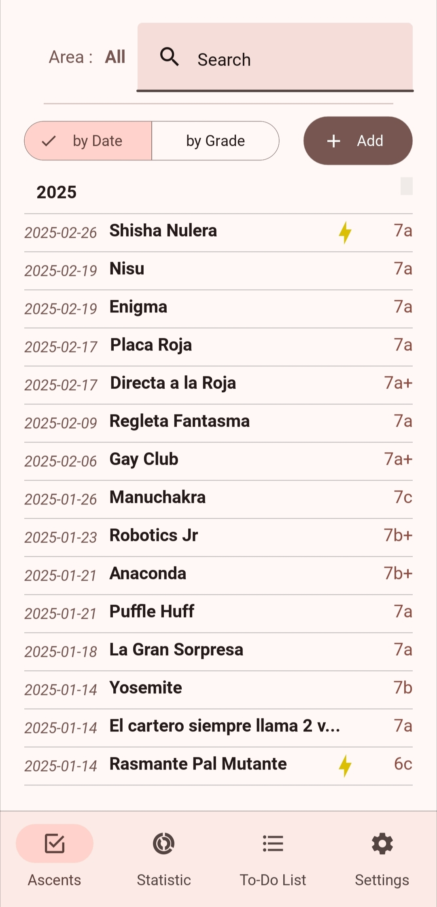
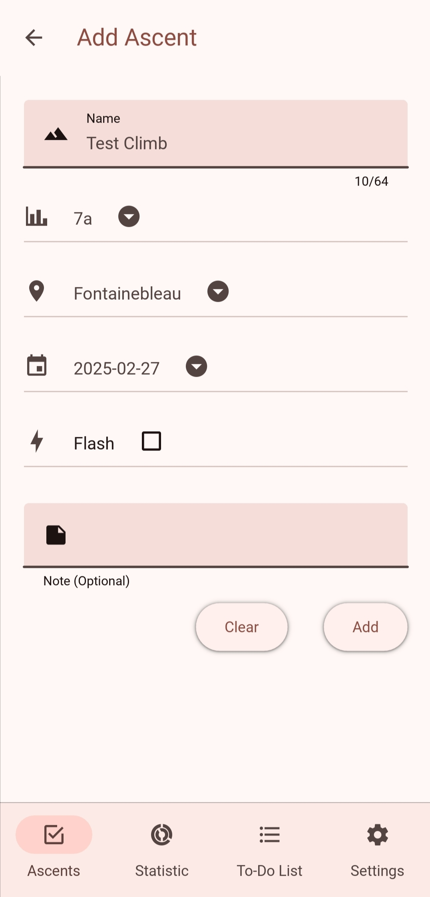
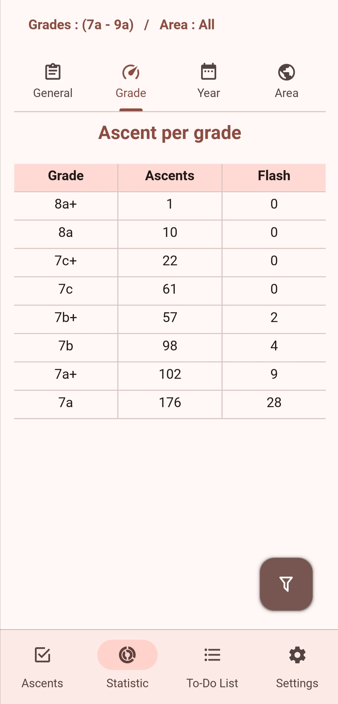
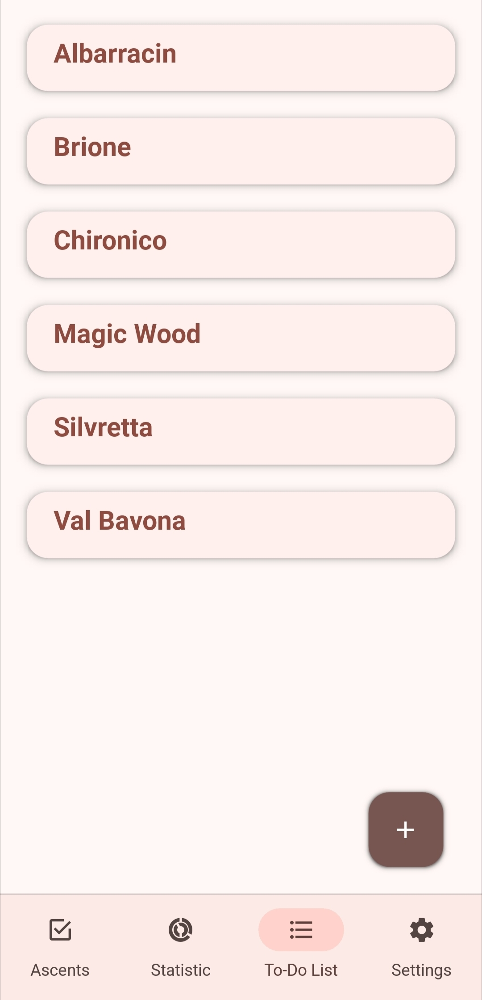
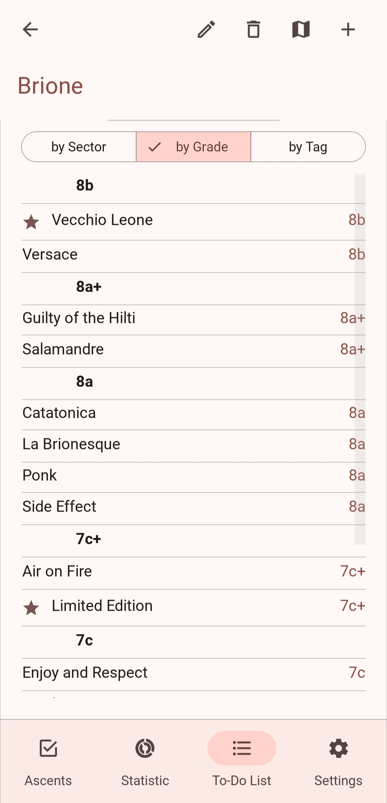
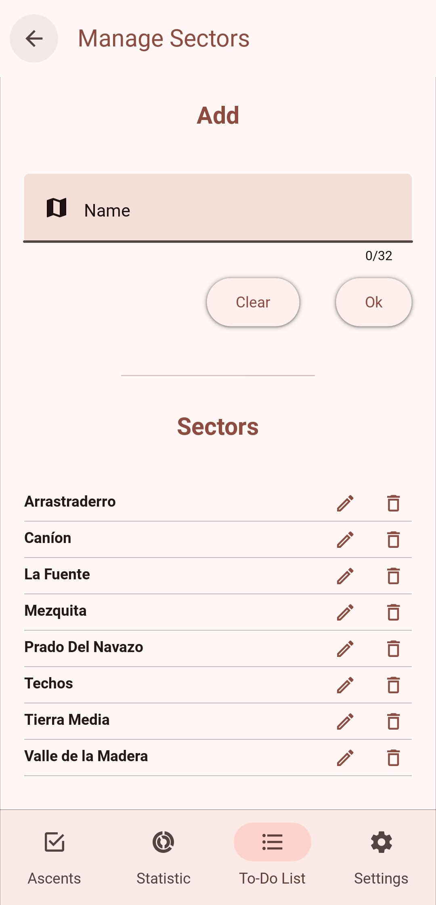

# **Astat - Climbing Log & Stats App**  

📱 **Astat** is a mobile app designed for climbers to log ascents, track progress, and generate statistics. Built with **Python & Kivy**, it offers a simple yet powerful way to analyze climbing performance.  

## 🚀 Features  
- 📊 **Track & Analyze Climbs** – Log ascents with key details and generate statistics. Include a Gtaph visualization of your progress  
- ✅ **Custom To-Do Lists** – Organize future climbs with sorting options.  
- 🔄 **Offline First** – Works seamlessly without an internet connection.  
- 🎨 **Intuitive UI** – Designed for ease of use and quick data entry.  

## 🛠 Tech Stack  
- **Languages:** Python, SQL  
- **Frameworks:** Kivy, SQLAlchemy  
- **Tools:** Git, Docker

## 📸 Screenshots  

|  |  |  |
|:-----------:|:-----------:|:------------:|
| **Ascent List screen** | **Adding Ascent Screen** | **Stats & Analytics** |

|  |  |  |
|:------------------------------:|:------------------------------:|:------------------------------:|
| **To-Do Lists** | **To-Do Lists Detail** | **Area Manager** |

## 📅 Planned Features  
- 🌐 **Cloud sync for multi-device access**  
